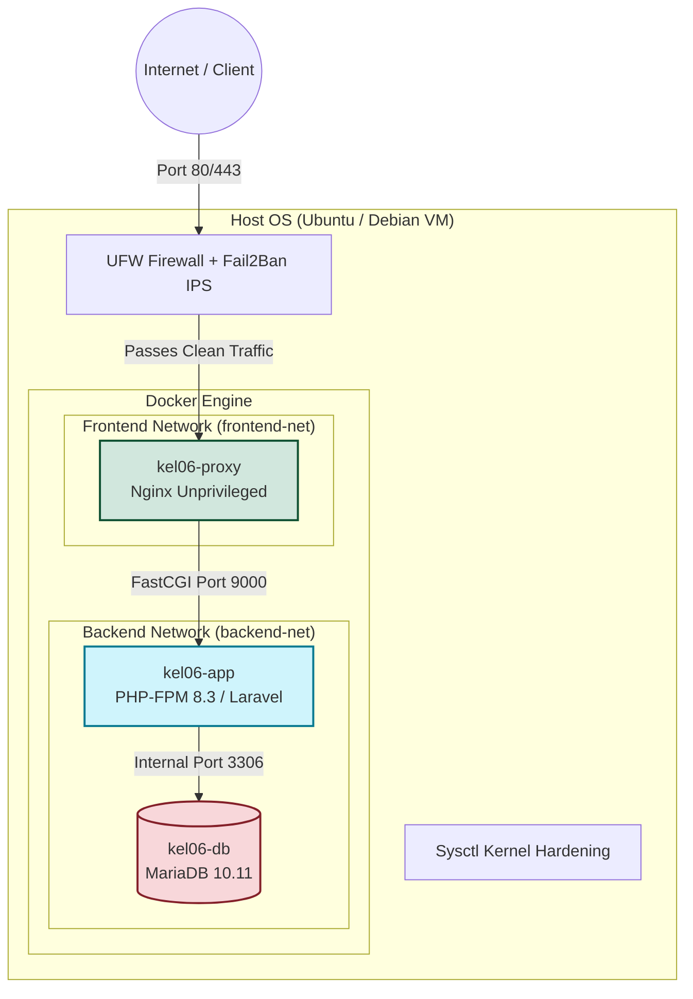

# Keamanan Server & Jaringan — Kelompok 06 (Topik A)
## Tugas Kuliah Universitas Sumatera Utara (USU)

🎥 **Link Presentasi:** [Google Drive](https://drive.google.com/file/d/1n0jRzwbYBMSnEpCdzJA7nMKxN2WHY1x-/view?usp=sharing)

Selamat datang di dokumentasi proyek kami. Proyek ini menyajikan implementasi **Arsitektur Server 3-Tier yang Aman (Hardened 3-Tier Architecture)** berbasis Docker (Nginx, PHP-FPM 8.3, dan MariaDB 10.11) untuk aplikasi Laravel. Kami juga melengkapinya dengan berbagai skrip otomatisasi pengamanan (*hardening*) sistem operasi, SSH, Firewall (UFW), Intrusion Prevention System (Fail2Ban), enkripsi SSL/TLS tingkat tinggi, serta mekanisme backup otomatis yang terintegrasi.

---

## 🏗️ Desain & Arsitektur Keamanan 3-Tier

Dalam proyek ini, kami menerapkan konsep *Defense in Depth* dengan membagi infrastruktur ke dalam 3 tier mandiri yang saling terisolasi penuh menggunakan Docker Bridge Networks:



1. **Tier 1 — Reverse Proxy (`kel06-proxy`):**
   * Kami menggunakan image **`nginxinc/nginx-unprivileged:alpine`** yang berjalan dengan hak akses pengguna non-root untuk meminimalkan dampak eksploitasi jika container berhasil ditembus.
   * *Filesystem* container dikonfigurasi sebagai **`read_only`** (immutable container), di mana hanya direktori sementara `/tmp` dan cache yang dapat ditulisi (*tmpfs*).
   * Proxy ini mengamankan jalur komunikasi menggunakan protokol HTTPS (TLS 1.2 & 1.3) serta secara otomatis mengalihkan (*redirect*) trafik HTTP (port 80) ke HTTPS (port 443).
2. **Tier 2 — Application Server (`kel06-app`):**
   * Container Laravel (PHP-FPM 8.3) dijalankan sebagai pengguna non-root (`laravel`).
   * Tier ini diisolasi dari database melalui bridge network privat (`backend-net`) dan hanya dapat dihubungi oleh proxy melalui `frontend-net`.
3. **Tier 3 — Database Server (`kel06-db`):**
   * Kami mengisolasi database MariaDB 10.11 secara penuh.
   * **Mekanisme Keamanan:** Port database `3306` sama sekali tidak diekspos ke Host OS untuk mencegah pemindaian port dari luar. Akses database hanya diizinkan secara internal dari container aplikasi (`kel06-app`) melalui `backend-net`.

---

## 🔒 Fitur & Implementasi Keamanan yang Kami Terapkan

### 1. SSL/TLS Hardening & Perfect Forward Secrecy (PFS)
* Kami men-generate sertifikat SSL secara mandiri (*self-signed certificate*) menggunakan kunci **RSA 4096-bit** dan algoritma signature **SHA-256** untuk menjamin kekuatan enkripsi.
* Sertifikat ini mendukung **Subject Alternative Name (SAN)** untuk memastikan validitasnya pada browser modern tanpa memicu peringatan ketidakcocokan domain (*Common Name warning*).
* Kami menyertakan **DH (Diffie-Hellman) Parameters 2048-bit** untuk memastikan kerahasiaan sesi komunikasi di masa depan (*Perfect Forward Secrecy*).

### 2. Nginx Hardening & Security Headers
Nginx telah kami konfigurasi secara ketat guna menangkal berbagai potensi serangan web:
* **Rate Limiting:** Kami membatasi frekuensi request berdasarkan IP (General: 10 req/detik dengan burst 20, Halaman Login/Auth: 5 req/detik dengan burst 10) untuk meredam serangan Brute-Force dan DDoS ringan.
* **Security Headers:** Kami mengaktifkan HTTP Strict Transport Security (HSTS selama 1 tahun), Content Security Policy (CSP), X-Frame-Options (anti-clickjacking), X-Content-Type-Options (anti-sniffing), X-XSS-Protection, Referrer Policy, dan Permissions Policy.
* **Server Hiding & Hardening:** Tanda tangan versi web server disembunyikan (`server_tokens off;` serta header `X-Powered-By`).
* **Proteksi Berkas Sensitif:** Kami menutup akses ke berkas sensitif (seperti `.env`, `.git`, sisa berkas *backup* `.bak`/`.sql`, dan direktori tersembunyi).

### 3. SSH & System Hardening (Host OS)
* Kami memindahkan port default SSH ke port kustom **`2206`** guna menghindari pemindaian port otomatis (*automated port scanning*).
* Menolak koneksi login root langsung via SSH (`PermitRootLogin no`).
* Menonaktifkan autentikasi menggunakan kata sandi biasa, sehingga mewajibkan penggunaan autentikasi berbasis kunci publik (*key-pair auth*).
* Kami memperketat izin akses (*file permissions*) untuk berkas kunci publik `.ssh/authorized_keys` dan direktori *home* pengguna (chmod 700 dan 600).

### 4. Firewall (UFW) & Intrusion Prevention System (Fail2Ban)
* Kebijakan firewall diatur ke *Default Deny* untuk semua koneksi masuk (*incoming*), dan hanya mengizinkan port yang memang diperlukan (SSH port `2206`, HTTP `80`, HTTPS `443`).
* Kami mengintegrasikan aturan Docker-UFW agar Docker daemon tidak dapat mengabaikan kebijakan firewall pada host.
* **Fail2Ban Jails:** Kami mengaktifkan 5 modul pemantau log aktif:
  1. `sshd`: Memblokir IP yang gagal autentikasi SSH sebanyak 3 kali (durasi ban: 1 jam).
  2. `nginx-http-auth`: Memblokir IP yang gagal login pada halaman web basic auth.
  3. `nginx-limit-req`: Memblokir IP yang melebihi batas rate-limiting Nginx (HTTP 429).
  4. `nginx-botsearch`: Memblokir IP bot atau scanner yang mencoba mengakses berkas sensitif (ban selama 24 jam).
  5. `recidive`: Memberikan hukuman pemblokiran lebih lama (1 minggu) bagi IP yang berulang kali melanggar aturan keamanan.
* **Kernel Sysctl Hardening:** Kami menerapkan konfigurasi parameter kernel untuk mencegah serangan jaringan (SYN cookies untuk menahan SYN Flood, Reverse Path Filtering untuk anti-spoofing, mematikan ICMP redirects dan mematikan respon ICMP broadcast, serta mengamankan memori dengan ASLR tingkat 2).

### 5. Sistem Backup Otomatis & Terintegritas
* Kami membuat skrip backup database secara aman dari dalam container database.
* Skrip ini turut mencadangkan berkas konfigurasi kritis (`docker-compose.yml`, `.env`, dan direktori `docker/`).
* Berkas backup dikompresi ke format `.tar.gz` dengan izin akses aman (`chmod 600`) dan diverifikasi menggunakan **SHA256 Checksum**.
* **Retensi Otomatis:** Sistem akan menghapus otomatis arsip backup yang berusia lebih dari 7 hari guna menjaga efisiensi ruang penyimpanan.
* **Notifikasi Aktif:** Mengirimkan laporan status backup (sukses/gagal) secara langsung ke **Telegram Bot** dan **Email** tim pengelola.

---

## 📂 Struktur Berkas Skrip (`scripts/`)

Guna mengotomatisasi pengamanan, kami telah menyusun 4 buah berkas skrip utama:

| Nama Skrip | Fungsi Utama | Cara Menjalankan |
| --- | --- | --- |
| **[`generate-ssl.sh`](file:///c:/laragon/www/kel-06-topik-a/scripts/generate-ssl.sh)** | Men-generate sertifikat SSL Self-Signed dengan SAN & DH Parameters. | `sudo bash scripts/generate-ssl.sh` |
| **[`setup.sh`](file:///c:/laragon/www/kel-06-topik-a/scripts/setup.sh)** | Mengonfigurasi serta mengamankan konfigurasi SSH dan izin berkas sistem. | `sudo bash scripts/setup.sh [PORT_KUSTOM]` |
| **[`firewall.sh`](file:///c:/laragon/www/kel-06-topik-a/scripts/firewall.sh)** | Memasang firewall UFW, konfigurasi kompatibilitas Docker, mengaktifkan Fail2Ban, dan sysctl hardening. | `sudo bash scripts/firewall.sh [SSH_PORT]` |
| **[`backup.sh`](file:///c:/laragon/www/kel-06-topik-a/scripts/backup.sh)** | Melakukan backup database dan konfigurasi, verifikasi integritas, retensi, serta pengiriman notifikasi. | `sudo bash scripts/backup.sh` |

---

## 🚀 Panduan Pemasangan & Konfigurasi Sistem (Deployment Guide)

### 1. Inisialisasi Keamanan Host OS (VM Linux)
Sebelum menjalankan container, kami melakukan langkah pengamanan awal pada sistem operasi host:

```bash
# Melakukan clone repository
git clone <url-repository-anda>
cd kel-06-topik-a

# Memberikan izin eksekusi skrip
chmod +x scripts/*.sh

# 1. Menjalankan SSH Hardening (mengubah port SSH ke 2206 dan mematikan password login)
sudo bash scripts/setup.sh 2206

# 2. Menjalankan konfigurasi UFW Firewall, Fail2Ban, dan Sysctl Kernel Hardening
sudo bash scripts/firewall.sh 2206
```

### 2. Generate SSL Certificate
Kami men-generate sertifikat SSL lokal agar layanan Nginx dapat berjalan di atas protokol HTTPS:

```bash
sudo bash scripts/generate-ssl.sh
```
Skrip ini akan menempatkan berkas sertifikat (`server.crt`, `server.key`, dan `dhparam.pem`) pada direktori `./docker/nginx/ssl/`.

### 3. Konfigurasi Environment File (`.env`)
Salin file template `.env.example` menjadi `.env` di root direktori project:
```bash
cp .env.example .env
```
Sesuaikan kredensial database dan tambahkan token Telegram/Email untuk keperluan backup jika diperlukan:
```bash
# Contoh konfigurasi notifikasi backup di .env
TELEGRAM_BOT_TOKEN="token_bot_telegram_anda"
TELEGRAM_CHAT_ID="id_chat_penerima"
EMAIL_RECIPIENT="email_admin@domain.com"
```

### 4. Build & Jalankan Docker Container
Jalankan Docker Compose untuk membuild dan menyalakan container di background:
```bash
docker compose up -d --build
```

### 5. Install Dependensi Aplikasi (Composer & NPM)
Masuk ke container aplikasi (`kel06-app`) untuk menginstal paket dependensi Laravel:
```bash
# Install PHP dependencies (Composer)
docker compose exec app composer install

# Install Frontend dependencies (NPM)
docker compose exec app npm install

# Build asset frontend (Vite)
docker compose exec app npm run build
```

### 6. Generate Key & Migrasi Database
Jalankan perintah berikut untuk menginisialisasi aplikasi Laravel:
```bash
# Generate app key
docker compose exec app php artisan key:generate

# Jalankan migrasi database beserta data awal (seeders)
docker compose exec app php artisan migrate --seed
```

Aplikasi kini dapat diakses dengan protokol HTTPS yang aman pada alamat **`https://localhost`** atau **`https://kel06.local`**.

---

## 📅 Otomatisasi Backup via Cron Job

Untuk menjamin ketersediaan data, kami menjadwalkan eksekusi skrip backup setiap hari pada pukul **01:00 WIB** dengan mendaftarkannya pada crontab root Host OS:

```bash
# Membuka crontab root
sudo crontab -e
```

Pernyataan berikut ditambahkan pada baris terakhir crontab:
```cron
0 1 * * * /bin/bash /absolute/path/to/kel-06-topik-a/scripts/backup.sh >> /var/log/project-backup.log 2>&1
```
*(Ganti `/absolute/path/to/kel-06-topik-a` dengan path riil direktori proyek).*

---

## 🔍 Panduan Pengujian & Verifikasi untuk Bapak/Ibu Dosen / Penguji

Guna mempermudah Bapak/Ibu Dosen atau Penguji dalam memverifikasi dan menguji keandalan sistem keamanan yang telah kami rancang, berikut adalah serangkaian perintah pengujian yang dapat dieksekusi langsung pada server:

### 1. Verifikasi Aturan Firewall (UFW)
Untuk memeriksa status firewall dan memastikan hanya port yang diperlukan saja yang terbuka:
```bash
# Menampilkan aturan firewall yang aktif beserta tingkat logging-nya
sudo ufw status verbose

# Menampilkan aturan firewall dengan nomor indeks aturan
sudo ufw status numbered
```

### 2. Verifikasi Intrusion Prevention (Fail2Ban)
Untuk memantau aktivitas pemblokiran otomatis terhadap lalu lintas mencurigakan:
```bash
# Memeriksa daftar modul jail Fail2Ban yang sedang aktif
sudo fail2ban-client status

# Melihat detail IP yang sedang diblokir karena percobaan login SSH yang gagal
sudo fail2ban-client status sshd

# Melihat detail IP yang diblokir akibat melanggar batas rate-limiting Nginx
sudo fail2ban-client status nginx-limit-req

# Membuka blokir (unban) IP secara manual
sudo fail2ban-client set <nama-jail> unbanip <IP-Address>
```

### 3. Verifikasi Proteksi Kernel (Sysctl)
Untuk memastikan sistem operasi host kebal terhadap serangan jaringan tingkat rendah:
```bash
# Menampilkan seluruh nilai sysctl ipv4 yang sedang berlaku
sysctl -a | grep net.ipv4

# Memastikan fitur SYN Cookies aktif (bernilai 1) untuk menangkal serangan SYN Flood
sysctl net.ipv4.tcp_syncookies
```

### 4. Memantau Log Aktivitas Keamanan
Untuk memantau aktivitas operasional harian secara langsung:
```bash
# Membaca log proses backup secara realtime
tail -f /var/log/project-backup.log

# Memantau log deteksi dan pemblokiran otomatis oleh Fail2Ban
tail -f /var/log/fail2ban.log
```
